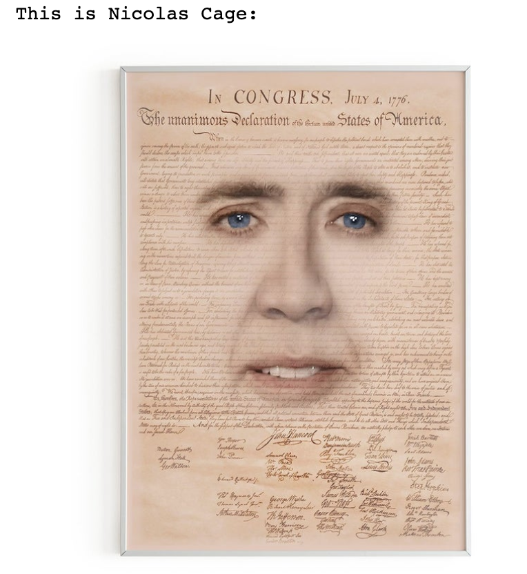

# My first Deep Learning project - A Convolutional Neural Network that classifies images of Nicolas Cage 
Check out the medium article I wrote on this project [here](https://towardsdatascience.com/my-first-contribution-to-data-science-a-convolutional-neural-network-that-recognizes-images-of-fdf9b01c6925?source=friends_link&sk=ab74dbc1a8f192509544920623197e9c)

## Purpose:
In this project I wanted to learn the basics of neural networks, deep learning, and convolution. I also wanted to apply a goofy twist to the project with Nicolas Cage images.  

## Example output:



## Built with:
* python=3.6.4
* numpy=1.16.4
* Tensorflow=1.14.0
* Keras=2.2.4

## Files: 
* Nic_Cage_SourceCode.ipynb - Source code for the model 
* Nic_Cage_Explanation.ipynb - The full model source code along with explanations of the code and explanations of concepts like Convolution, Maxpooling, and Backpropagation
* Jupyter_Images - contains the visual aid image files used in the explanation notebook
* Dataset - contains the images used for training the classifier. It contains 2 classes. Class0 being the random "not Nicolas Cage" images and Class1 being the images of Nicolas Cage
* Predict - contains some funny Nicolas Cage memes used for testing out our classifier after it's been trained 

## Usage 
To start the notebook run ```jupyter notebook``` in terminal 
